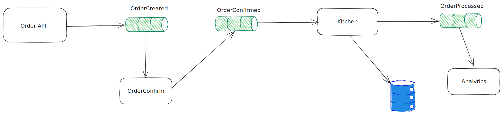

# spring-boot-test-container-kafka-zipkin
A spring boot project that demonstrate Kafka Setup with distributed tracing and test container support.

See the full explanation at [http://www.dreaminghk.com](https://www.dreaminghk.com/2024/09/21/how-i-built-a-real-time-event-system-with-spring-boot-and-spring-kafka-and-you-can-too/)

## Overview

This is a Spring Boot project that include all the above component. All the API endpoint, kafka producer and consumer are in the same file.

## Run the project in dev mode

run [TestRestaurantApplication.java](./src/main/java/alexlib/restaurantapp/TestRestaurantApplication.java) # It works!
and it will start the app with a kafka and zipkin using test-container. You will need docker installed and in running state.

## Run the project
run
[RestaurantApplication.java](./src/main/java/alexlib/restaurantapp/RestaurantApplication.java) and the configuration are in [application.properties](src/main/resources/application.properties)

# Example Request
There are example API requests in [test.http](./test.http). You can open it with vscode RestClient plugin.

